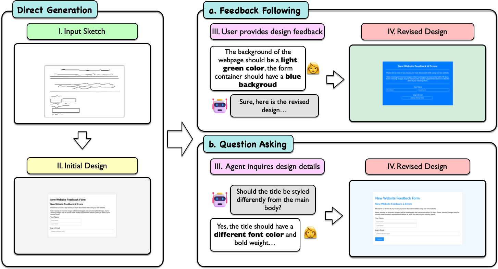
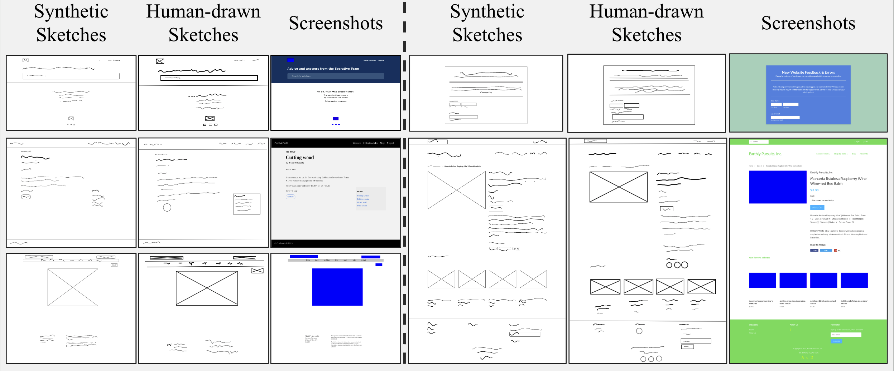
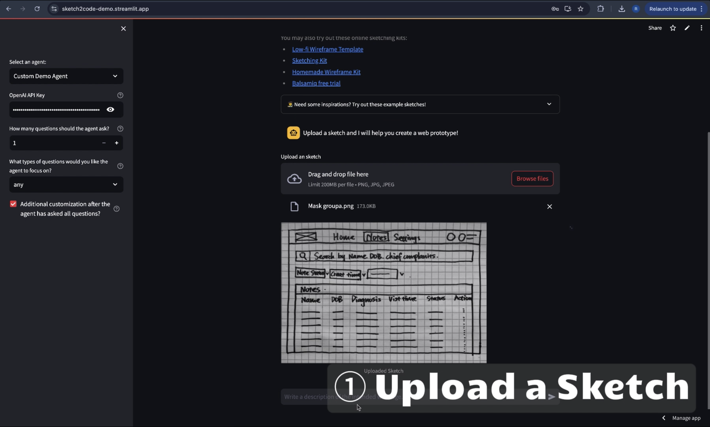

# Sketch2Code: Evaluating Vision-Language Models for Interactive Web Design Prototyping

Quick Links:
[[Dataset]](https://huggingface.co/datasets/SALT-NLP/Sketch2Code) 
[[Video]](https://youtu.be/lacoqfNdZgg)
[[Live Demo]](https://sketch2code-demo.streamlit.app/) 
[[Project Page]](https://salt-nlp.github.io/Sketch2Code-Project-Page/)
[[Paper]](https://arxiv.org/abs/2410.16232)

## Overview



This is the official code repository for Sketch2Code, maintained by the SALT lab from Stanford NLP.

We provide:
- The Sketch2Code benchmark [dataset](https://huggingface.co/datasets/SALT-NLP/Sketch2Code) for evaluating Vision-Language Models (VLMs) on automating the conversion of rudimentary sketches to webpage prototypes.
- All [experiment scripts](https://github.com/SALT-NLP/Sketch2Code/edit/main/README.md#synthetic-sketch-generation) that benchmarks 10 SoTA VLMs with both direct evaluation and multi-turn interactive evaluations.
- An automated, easy-to-use [pipeline](https://github.com/SALT-NLP/Sketch2Code/edit/main/README.md#synthetic-sketch-generation) for generating synthetic sketches from real-world webpages at scale, which can be used to curate training data.
- The code implementation for the [Sketch2Code Demo Agent](https://sketch2code-demo.streamlit.app/).

## Setup

1. Installing Dependencies

The experiment code requires python version >= 3.9, we recommend setting up a virtual environment (e.g., [miniconda](https://docs.anaconda.com/miniconda/)) to manage the dependencies.
Once you've created your conda environment, install the dependencies via
```
pip install -r requirements.txt
```

Taking screenshots and running evaluations also need to install browsers.
```
playwright install
```

If the above doesn't work, try:
```
python3 -m playwright install
```

2. Environment Variables

Set up the API Keys for OpenAI, Anthropic, and Gemini to use the corresponding models:
```
EXPORT OPENAI_API_KEY={Your_OpenAI_API_Key}
EXPORT ANTHROPIC_API_KEY={Your_Anthropic_API_Key}
EXPORT GOOGLE_API_KEY={Your_Gemini_API_Key}
```

Note that you don't need to have all the api keys. You may only export the ones that you are planning to benchmark.

## Dataset Access
You can download the full dataset directly through this [link](https://huggingface.co/datasets/SALT-NLP/Sketch2Code/resolve/main/sketch2code_dataset_v1.zip?download=true). After unzipping, all 731 sketches (`{webpage_id}_{sketch_id}.png`) and 484 webpage screenshots + HTMLs (`{webpage_id}.html` and `{webpage_id}.png`) will be appear flattened under `sketch2code_dataset_v1_cleaned/`. We also include `rick.jpg` which is used to render the image placeholder in the HTML code.

Alternatively, you may access the raw [dataset](https://huggingface.co/datasets/SALT-NLP/Sketch2Code) using `huggingface_hub` or load the dataset directly in [Huggingface format](https://huggingface.co/datasets/SALT-NLP/Sketch2Code-hf). However, please note that the current experiment scripts expect all data files to appear in the same local directory. You may have to adjust the experiment scripts to access the dataset from Huggingface.

## Running Benchmark Scripts
To run evaluation benchmarks on GPT-4O, simply run the following commands:
```
# direct evaluation
python experiments/gpt4_direct.py --model gpt-4o --input_dir /path/to/your/sketch2code/dataset --out_dir /path/to/your/output/directory

# the question asking benchmark
python experiments/gpt4_qa.py --model gpt-4o --input_dir /path/to/your/sketch2code/dataset --out_dir /path/to/your/output/directory

# the feedback following benchmark
python experiments/gpt4_reflect.py --model gpt-4o --input_dir /path/to/your/sketch2code/dataset --out_dir /path/to/your/output/directory
```
You may run the evaluation scripts for other models using the same set of command-line parameters.

## Synthetic Sketch Generation
We provide the following tools to facilitate generating synthetic training sketches at scale:
```
  ── sketch_generation
    ├── image_to_wireframe.py  # an automated pipeline that converts source webpages (HTMLs) to standard wireframes
    ├── image_to_sketch.py     # additional utility functions to convert webpages into sketches with varying styles (e.g., with hand-written font, or replacing all texts with black rectangles)
    └── process_dataset.py     # an example script that processes an entire dataset in Huggingface format (e.g., HuggingFaceM4/WebSight)
```

To generate synthetic sketches for training, you would first have to prepare all source webpage HTMLs inside a single directory. Then, convert the webpages to standard wireframes via:
```
python sketch_generation/image_to_wireframe.py --input_dir /path/to/your/input/htmls --out_dir /path/to/your/output/directory
```

To process existing Huggingface datasets, you should first replace the line `dataset = load_from_disk("/juice2/scr2/nlp/pix2code/zyanzhe/WebSight_82k_train/")` inside `sketch_generation/process_dataset.py` to load your source dataset and change the `out_dir` to your target output directory. Depending on the structure of the dataset, you may also want to adjust the function `process_example` to match the column/feature names of the source dataset.

Converting each webpage to wireframe sketches roughly takes 2~3 seconds. We were able to obtain high-quality generations that were comparable to human-drawn sketches.


## Launching Sketch2Code Demo Agent
The `demo/` directory contains the source code for our Sketch2Code Demo Agent. To launch the app locally, run:
```
cd demo
streamlit run app.py
```
Alternatively, you may access our existing deployment [here](https://sketch2code-demo.streamlit.app/). Click below the watch the video demo:

[](https://youtu.be/ofe3yJNAJnU)

## Acknowledgement
The Sketch2Code dataset and codebase are built on top of [Design2Code](https://github.com/NoviScl/Design2Code), which is under these licenses: [code license](https://github.com/NoviScl/Design2Code/blob/main/CODE_LICENSE), [data_license](https://github.com/NoviScl/Design2Code/blob/main/DATA_LICENSE). We distribute our work under the same licenses. Thanks for the amazing work!

If you find our work helpful, please consider citing our paper:

```
@misc{li2024sketch2codeevaluatingvisionlanguagemodels,
      title={Sketch2Code: Evaluating Vision-Language Models for Interactive Web Design Prototyping}, 
      author={Ryan Li and Yanzhe Zhang and Diyi Yang},
      year={2024},
      eprint={2410.16232},
      archivePrefix={arXiv},
      primaryClass={cs.CL},
      url={https://arxiv.org/abs/2410.16232}, 
}
```

We welcome all kinds of contributions. If you have any questions, feel free to leave issues or email us.

